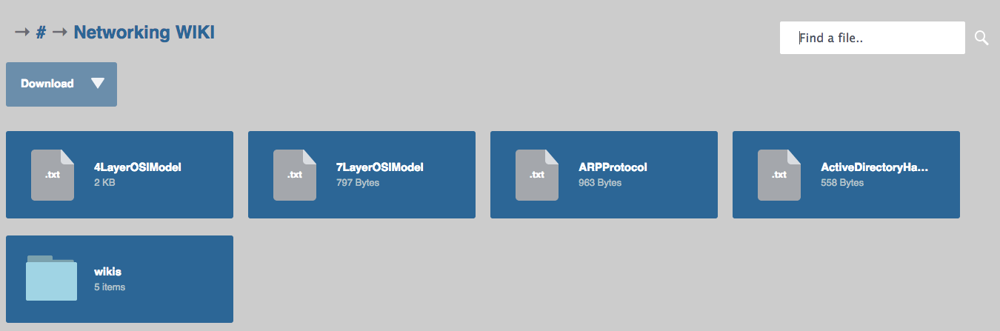

#Go lang file browser

* Inspired by the Cute File Browser
* CSS based on Cute file browser CSS
* Javascript rewritten to fit the format of the JSON coming from server
* Backend is written in Go using the Revel web framework
* Currently directory location hardcoded to local machine however on a production machine the directory can be elsewhere if an ENV variable is set - see:

~~~

func initialize(dir string) {
    if os.Getenv("STATE") == "PRODUCTION" {
    directoryLocation = "/srv/directory/"
  } else {
    directoryLocation = os.Getenv("HOME") + dir
  }
}
~~~

####Screen shot:

